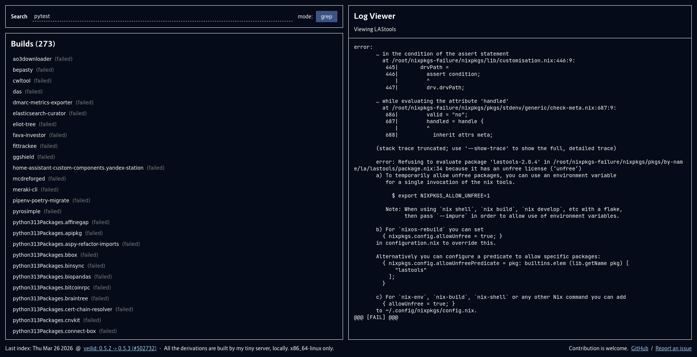

# Nixpkgs failure dashboard



Use `./build-all-packages.sh` or `./run-build list` to gather build logs for
the derivations.

### Run the dashboard

1 - prepare the back
```
python -m venv venv
venv/bin/pip install -e .
venv/bin/classify-build-logs
```

2 - build the front
```
pnpm i
pnpm build
```

3 - run the server
```
venv/bin/nixpkgs-failure-dashboard
```
